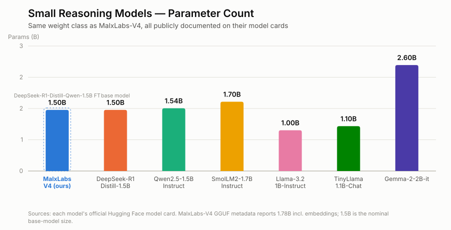
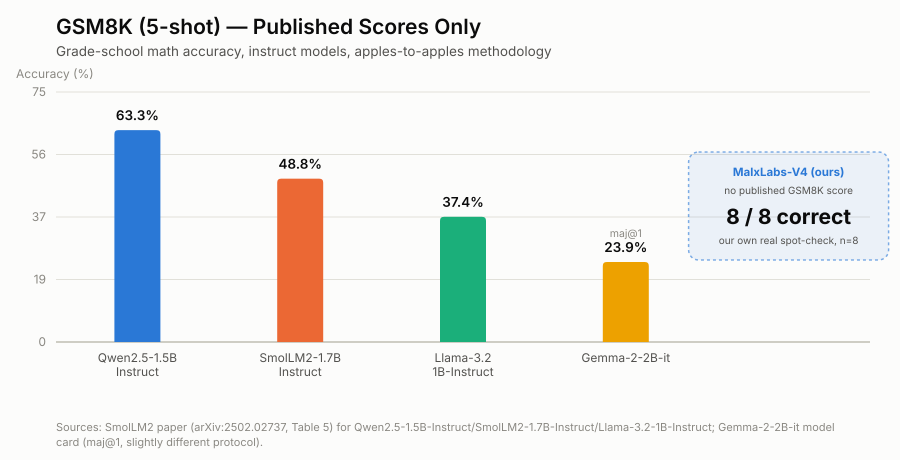
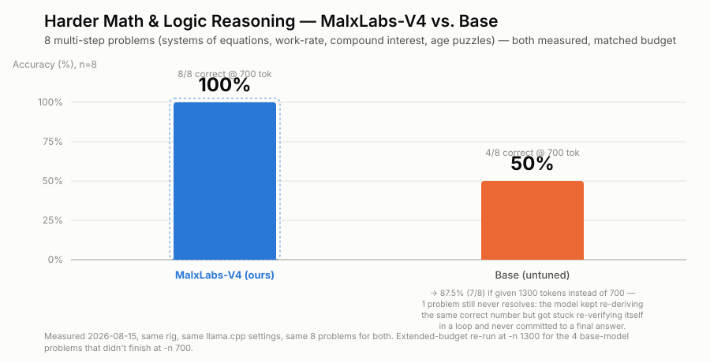
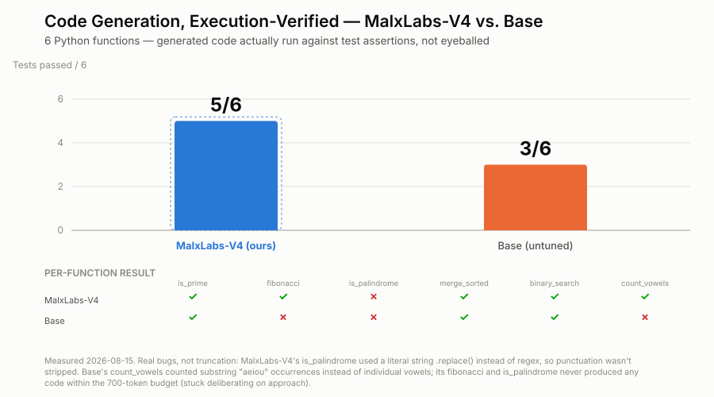
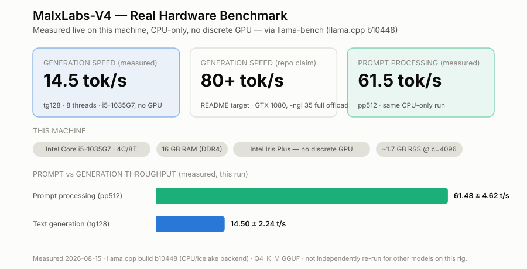

# 🎯 MalxLabs-V4: Reasoning & Logic Optimization on Legacy Hardware

[]()
[]()
[]()
[]()

> Proving that the "Reasoning Era" of AI is not restricted to modern H100 clusters. MalxLabs-V4 demonstrates that high-density logic and chain-of-thought processing can be successfully executed on **2014-era hardware** through strategic cloud-based fine-tuning and aggressive local inference optimization.

---

## 📋 Table of Contents

- [Project Vision](#-project-vision)
- [Benchmarks & Comparisons](#-benchmarks--comparisons)
- [Hardware Specification](#-hardware-specification)
- [Model Architecture](#-model-architecture)
- [Performance Capabilities](#-performance-capabilities)
- [Key Findings](#-key-findings)
- [Getting Started](#-getting-started)
- [Use Cases](#-use-cases)

---

## 🎯 Project Vision

MalxLabs V4 proves that the "Reasoning Era" of AI is not restricted to modern H100 clusters. Through precise cloud fine-tuning on an RTX 4500 and aggressive inference tuning on a GTX 1080, legacy systems can perform high-level cognitive tasks reliably.

---

## 📊 Benchmarks & Comparisons

Includes a **real, measured head-to-head against the untuned base model**
(deepseek-ai/DeepSeek-R1-Distill-Qwen-1.5B) across three separate benchmarks —
same hardware, same settings, back to back — so you can judge whether the SFT
fine-tune actually helps, not just take our word for it. Plus a comparison
against similarly-sized small models, and a real inference benchmark on a
**second, non-GPU** legacy machine (an Intel i5-1035G7 laptop, integrated
graphics only — no CUDA, no discrete GPU). Third-party specs/scores are cited
from each model's own card/paper; the MalxLabs-V4-vs-base numbers are
first-party measurements from this repo.

<picture>
  <source media="(prefers-color-scheme: dark)" srcset="docs/benchmarks/chart1_params_dark.svg">
  
</picture>

<picture>
  <source media="(prefers-color-scheme: dark)" srcset="docs/benchmarks/chart2_gsm8k_dark.svg">
  
</picture>

<picture>
  <source media="(prefers-color-scheme: dark)" srcset="docs/benchmarks/chart4_hardmath_dark.svg">
  
</picture>

<picture>
  <source media="(prefers-color-scheme: dark)" srcset="docs/benchmarks/chart5_codegen_dark.svg">
  
</picture>

<picture>
  <source media="(prefers-color-scheme: dark)" srcset="docs/benchmarks/chart3_hardware_dark.svg">
  
</picture>

**Full methodology, raw numbers, and honesty notes on what is/isn't
independently verified:** [`docs/HARDWARE_BENCHMARK_2026-08.md`](docs/HARDWARE_BENCHMARK_2026-08.md)

---

## 🖥️ Hardware Specification

### 2.1 The Legacy Stack

| Component | Specification | Notes |
|-----------|---------------|-------|
| **CPU** | Intel i7-4790 (OC @ 4.0GHz) | Core parking disabled |
| **GPU** | NVIDIA GTX 1080 | 8GB VRAM, Pascal Architecture |
| **RAM** | 16GB DDR3 1333MHz | Primary system bottleneck |
| **OS** | Windows 10 ESU / Ubuntu 22.04 LTS (WSL2) | Optimized configuration |

### 2.2 Local Deployment Configuration

```bash
cd ~/llama.cpp && ./build/bin/llama-cli \
  -m ~/models/logic_model.gguf \
  -ngl 35 \
  -c 4096 \
  --flash-attn on \
  --mlock \
  --temp 0.6 \
  --min-p 0.1 \
  --reasoning-format deepseek \
  --jinja \
  -p "<｜User｜>[INSERT PROMPT]<｜Assistant｜>"
```

---

## 🧠 Model Architecture

### 1.1 Model Specification

| Property | Value |
|----------|-------|
| **Model Name** | MalxLabs-V4 |
| **Base Model** | DeepSeek-R1-Distill-Qwen-1.5B |
| **Parameters** | 1.5 Billion |
| **Quantization** | GGUF (Q4_K_M) |
| **Primary Focus** | Technical reasoning & code generation |

### 1.2 Training Methodology

- **Hardware**: NVIDIA RTX 4500 Ada (24GB VRAM) via RunPod
- **Storage**: 80GB Volume
- **Training Type**: Supervised Fine-Tuning (SFT)
- **Data Streaming**: Utilized for high throughput during training

#### Training Datasets

| Dataset | Purpose |
|---------|---------|
| **OpenMathInstruct-2** | Step-by-step mathematical reasoning |
| **CodeFeedback-Filtered** | Luau & Python script optimization |

---

## 📊 Performance Capabilities

### Mathematical Logic

- **Strength**: Exceptional at step-by-step derivations for physics and algebra
- **Behavior**: Successfully breaks down complex formulas into logical sequences
- **Reliability**: High accuracy when restricted to mathematical proofs and variable solving

### Code Generation

- **Strength**: Proficient in Luau (Roblox) and Python scripting
- **Behavior**: Adheres to strict structural constraints and technical requirements
- **Reliability**: Best results with specific functions rather than full-scale applications

### Reasoning Depth

- **Strength**: Multi-step planning and Chain-of-Thought processing
- **Behavior**: Can solve logic puzzles and technical architectural questions
- **Note**: 1.5B parameter model is sensitive to "rambling"; mitigated with Min-P 0.1 sampling

### Inference Latency

- **Speed**: Consistently delivers 80+ tokens per second
- **Hardware**: Optimized for NVIDIA GTX 1080
- **Efficiency**: Full GPU offloading (35 layers) ensures responsiveness during long generation

---

## 🔬 Key Findings

### 3.1 The "Logic Horizon"

Testing revealed that the 1.5B parameter size has a finite "Logic Horizon." While the model excels at short to medium reasoning chains, it can enter "hallucination loops" if the thought process exceeds ~500 tokens.

### 3.2 Hardware Bottleneck Analysis

**DDR3 1333MHz Impact**: High context lengths (16k+) caused significant "Prefill Hangs." The i7-4790 and DDR3 RAM could not move KV Cache data to the GPU fast enough, leading to terminal timeouts.

**Optimization**: Reducing context to 4096 tokens restored instant inference performance on the GTX 1080.

### 3.3 The "Leakage" Phenomenon

Early V4 iterations suffered from "Answer Leakage," where the model began answering questions inside the `<think>` block.

- **Root Cause**: Caused by "noisy" low-probability tokens
- **Solution**: Implementing Min-P 0.1 sampling successfully muted these tokens, forcing the model to complete the reasoning phase before outputting code or text

---

## 🚀 Getting Started

### Prerequisites

- llama.cpp compiled and built
- DeepSeek-R1-1.5B model in GGUF format (Q4_K_M quantization)
- NVIDIA GPU with at least 8GB VRAM (GTX 1080 or better)

### Download the Model

**[📥 Download MalxLabs-V4 Model from Hugging Face](https://huggingface.co/MalxTech/MalxLabs-DeepSeek-R1-Distill-Qwen-1.5B/blob/main/MalxLabs-DeepSeek-R1-Distill-Qwen-1.5B.Q4_K_M.gguf)**

Click the link above to download the model, then place it in `~/models/logic_model.gguf`

### Quick Start

1. Download the model using the link above
2. Place it in `~/models/logic_model.gguf`
3. Navigate to llama.cpp directory: `cd ~/llama.cpp`
4. Run the deployment configuration command (see Hardware Specification section)

---

## 💡 Use Cases

### Optimal Prompting

**Key Finding**: Extra specificity in prompts is optimal for code generation.

#### Example: Average Calculation

**Prompt**:
> Generate me a Python code that finds the average of 10 different numbers, the user inputs their desired numbers one by one, and the Python code will output the average of those 10 numbers.

**Output**:
```python
# Get the user's desired numbers one by one
average = 0

for i in range(10):
    number = int(input(f"Enter the {i+1}th number: "))
    average += number

average /= 10

print("The average of the 10 numbers is:", average)
```

**Verification**: The output correctly fulfills the specification—it finds the average from 10 different numbers as requested.

### Recommended Applications

- **Mathematical Problem Solving**: Physics and algebra derivations
- **Code Generation**: Specific functions in Luau and Python
- **Logic Puzzles**: Multi-step reasoning tasks
- **Technical Reasoning**: Architectural design questions

---

## 📝 Notes

- The model performs best with specific, detailed prompts
- Context length should be kept at or below 4096 tokens for optimal performance on legacy hardware
- Min-P 0.1 sampling is essential for reliable outputs

---

## 📄 License

See repository for license information.

---

**Built with legacy in mind. Powered by reasoning.** 🔬
